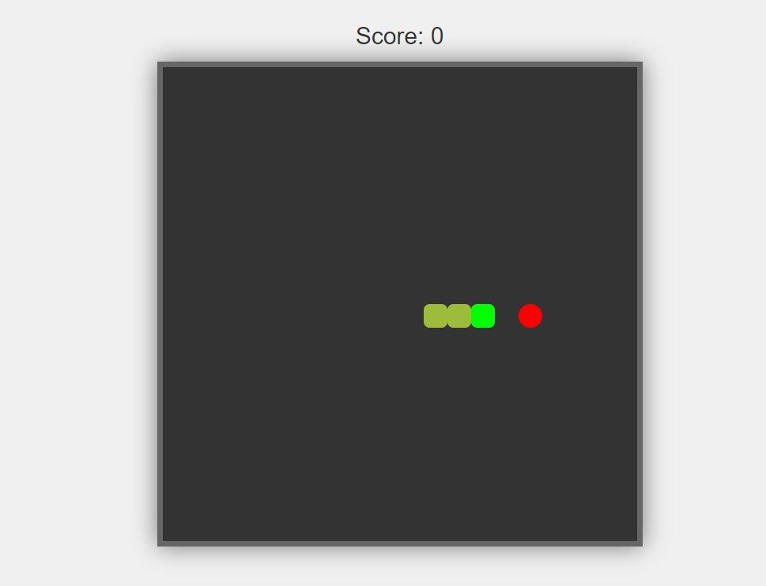

# SnakeGame

A simple Snake game developed using HTML, CSS, and JavaScript.



## Table of Contents

- [Introduction](#introduction)
- [Features](#features)
- [How to Play](#how-to-play)
- [Installation](#installation)


## Introduction

This project is a classic Snake game where players control a snake to eat food and grow longer. It was developed using HTML, CSS, and JavaScript.

## Features

- Responsive and interactive Snake game.
- Score tracking for each gameplay session.
- Game over alert with the final score.
- Start button to initiate the game.

## How to Play

- Use the arrow keys (Up, Down, Left, Right) to control the snake's movement.
- Eat the food to score points and grow the snake.
- Avoid collisions with the snake's body and the game boundaries.
- The game ends when the snake collides with itself or the walls.

## Installation

1. Clone the repository:

```bash
git https://github.com/Apurwa-Rokade/SnakeGame.git
